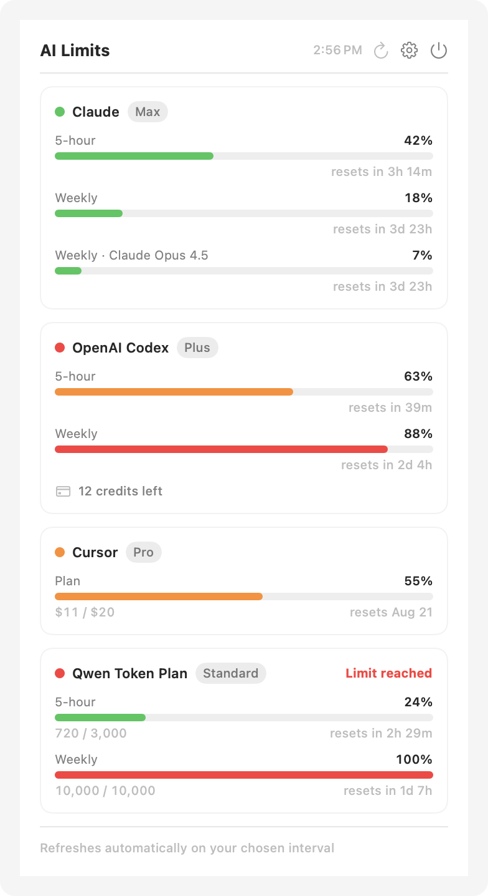

# AILimit

*[한국어 README](README.md)*

A macOS menu bar app that shows how much of your Claude, OpenAI Codex, Cursor and
Qwen subscription limits you have left.

<picture>
  <source media="(prefers-color-scheme: dark)" srcset="docs/popover-dark-en.png">
  
</picture>

The interface follows your system language (English or Korean) and can be
pinned to either one in Settings.

## Menu bar


**One column per provider**, coloured by severity (green &lt; 50% ≤ amber &lt; 85% ≤ red).
The width tracks how many services you actually configured, so two providers draw
two columns rather than leaving gaps. Services you never set up are left out
entirely; a configured one that fails to refresh keeps its column as a dim marker
so the icon does not reflow on a transient error.

The number beside the columns is a single provider you pick in Settings. That
matters more than it sounds: a single aggregated maximum is useless in practice,
because any provider parked at 100% for days pins the whole icon to 100% and
hides every other service — exactly when you most want to check them.

## Features

- Hover the icon for the popover; click to pin it
- Per-window usage bars with a plain-language countdown (`resets in 2d 23h`)
- Plan badges that survive a failed refresh — the tier did not change just
  because one request timed out
- Usage against the plan total where the API exposes it (`10,000 / 10,000`, `$11 / $20`)
- Money and credit facts that a percentage cannot express, shown only when the
  provider actually has them: extra-usage credits, uncapped on-demand spend,
  add-on packs
- Refreshes on a configurable interval and caches the last result to disk, so the
  popover is populated the moment it opens
- English and Korean, following the system language unless you pin one

## Where the numbers come from

None of these vendors publish an API for subscription limits, so AILimit reads
whatever credential each tool already stores locally and calls the same endpoint
the official client does.

| Service | Source | Endpoint |
|---|---|---|
| Claude | macOS Keychain `Claude Code-credentials` (falls back to `~/.claude/.credentials.json`) | `api.anthropic.com/api/oauth/usage` |
| OpenAI | `~/.codex/auth.json` | `chatgpt.com/backend-api/wham/usage` |
| Cursor | Cursor.app's `state.vscdb` (falls back to browser cookies) | `cursor.com/api/usage-summary` |
| Qwen | Browser cookies for the Alibaba console | Bailian console gateway |

Claude, OpenAI and Cursor need no setup beyond being logged in to those tools.
Qwen needs a browser session for the Alibaba console.

## What this app reads

It handles credentials, so here is precisely what it touches and what it does not.

| Target | Reads | Scope |
|---|---|---|
| OpenAI | `~/.codex/auth.json` | that file only |
| Cursor | `cursorAuth/*` keys in Cursor's state database | those keys only |
| Claude | Keychain item `Claude Code-credentials` | that item only |
| Qwen | Browser cookies for **Alibaba console domains** | those domains only |
| Cursor (fallback) | Browser cookies for **cursor.com** | that domain only |

- **Nothing is transmitted anywhere else.** Credentials go only to each vendor's
  own endpoint. No intermediary server, no analytics, no telemetry.
- Browser cookies are queried for the two domains above. No other site is read.
- Imported cookies are stored in the macOS Keychain, never written to disk in
  the clear.
- Only results — percentages and reset times — are cached to
  `~/Library/Application Support/AILimit/cache.json`. Credentials are not.
- A background refresh never raises a Keychain prompt. If access is denied it
  fails quietly and falls back to the last good value.

The source is right here, so you can check all of it: `BrowserCookies.swift`,
`Keychain.swift`, `Providers/`.

## Install

Requires **macOS 14+** and the Xcode command line tools (`xcode-select --install`).

```bash
git clone https://github.com/visualic/ai-limit.git
cd ai-limit
./Scripts/install.sh       # checks prerequisites, builds, installs, launches
```

You can hand this to an AI coding tool — cloning the repo and running
`./Scripts/install.sh` is the whole job, and [AGENTS.md](AGENTS.md) tells it what
it needs to know. Two dialogs still need a human: the Xcode tools installer, if
you do not have it, and the Keychain approval below.

Prefer doing it by hand:

```bash
./Scripts/package_app.sh
rm -rf /Applications/AILimit.app && cp -R build/AILimit.app /Applications/
open /Applications/AILimit.app
```

An icon appears in the menu bar. Claude and Qwen each need a one-time Keychain
approval — with the display awake, hit the refresh button (↻) in the popover and
choose **Always Allow**, then do the same for Qwen via Settings → "Import now".
OpenAI and Cursor read plain local files and need no approval.

## Code signing

`package_app.sh` picks the best identity available: `$AILIMIT_SIGN_IDENTITY`, then
Developer ID Application, then Apple Development, then ad-hoc.

This is not cosmetic. Legacy Keychain items carry a per-application ACL keyed on
the app's designated requirement, and ad-hoc signing derives that from the code
hash — so **every rebuild is a different app to macOS** and Keychain access has to
be granted again:

```
ad-hoc              designated => cdhash H"8eaf49ac…"      ← changes every build
Apple Development   designated => identifier "com.visualic.ai-limit" and
                                  anchor apple generic and certificate leaf[…]
```

Signing with a real certificate keeps that requirement identical across rebuilds,
so a grant sticks. Any Apple Development certificate (free accounts get one) is
enough for personal use.

To hand the app to someone else, `Scripts/release.sh` builds a notarized,
stapled DMG. Gatekeeper requires a Developer ID signature, the hardened runtime
and a stapled ticket, and blocks the app if any one is missing, so the script
checks all three before uploading anything.

## Development

```bash
./Scripts/run.sh                      # debug build
.build/debug/AILimit --check          # query every provider, no UI
.build/debug/AILimit --check -language en   # force a language
.build/debug/AILimit --selftest       # 120 parsing / classification cases
.build/debug/AILimit --preview-app    # drive the real popover, screenshot it
.build/debug/AILimit --screenshot     # regenerate the images in docs/
```

Those flags are wrapped in `#if DEBUG` and are absent from release builds.

## Credits

Endpoint research referenced [CodexBar](https://github.com/steipete/CodexBar) (MIT).

## License

MIT — see [LICENSE](LICENSE).
