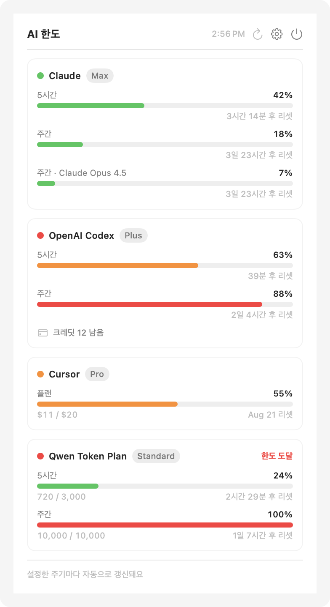

# AILimit

*[English README](README.en.md)*

Claude · OpenAI(Codex) · Cursor · Qwen(Alibaba Token Plan) 구독 한도를 macOS 메뉴바에서 실시간으로 확인하는 앱입니다.

아이콘에 커서를 올리면 각 서비스의 사용량(5시간/주간 윈도우)과 리셋 시점이 팝오버로 표시됩니다.

<picture>
  <source media="(prefers-color-scheme: dark)" srcset="docs/popover-dark.png">
  
</picture>

메뉴바에는 서비스마다 막대 하나씩 표시됩니다.


## 기능

- 메뉴바 막대 — **서비스마다 막대 하나**, 색상으로 상태 표현 (녹색 < 50% ≤ 황색 < 85% ≤ 적색).
  등록한 서비스 수에 맞춰 폭이 줄고 늘어납니다 (2개면 막대 2개). 숫자는 설정에서 고른 서비스 하나만 표시
- 아이콘에 hover하면 팝오버 자동 표시, 클릭하면 고정
- 서비스별 사용량 바 + "2일 23시간 후 리셋" 카운트다운
- Qwen은 플랜 총량 대비 사용량(`10,000 / 10,000`)까지 함께 표시
- **안 쓰는 서비스는 끄기** — 설정 → 서비스에서 끄면 팝오버·메뉴바에서 빠지고,
  갱신할 때 조회도 하지 않습니다. 설정값은 남아 있어서 다시 켜면 그대로 돌아옵니다
- **한국어·영어 지원** — 시스템 언어를 따르고, 설정에서 고정할 수도 있습니다
- 퍼센트로 표현되지 않는 **요금·크레딧 정보**는 카드 하단에 한 줄로 (추가 사용량 크레딧, 한도 없는 종량 과금, 추가 팩 등).
  실제로 켜져 있을 때만 나타나므로 평소에는 화면을 어지럽히지 않습니다
- Qwen 쿠키는 브라우저에서 자동으로 가져옵니다 (cURL 복사 불필요)
- 5분(설정 가능) 주기 자동 갱신 + 수동 갱신
- 마지막 결과를 디스크에 캐시해 실행 즉시 표시

## 데이터 소스

| 서비스 | 방식 |
|---|---|
| Claude | Claude Code의 OAuth 자격증명(**macOS Keychain** `Claude Code-credentials`, 없으면 `~/.claude/.credentials.json`)으로 공식 usage API 조회 |
| OpenAI | Codex CLI의 토큰(`~/.codex/auth.json`)으로 ChatGPT usage API 조회, 만료 시 refresh token으로 자동 갱신 |
| Cursor | `cursor.com/api/usage-summary` — **Cursor 앱의 로컬 세션** 우선, 없으면 브라우저 쿠키 |
| Qwen | Alibaba Token Plan(Bailian) 콘솔 내부 API — 브라우저에서 쿠키 자동 임포트 (아래 참고) |

Claude·OpenAI·Cursor는 별도 설정이 필요 없습니다. 각 앱/CLI에 로그인되어 있으면 그대로 씁니다.
Qwen만 브라우저 로그인 세션이 필요합니다.

### 인증 방식이 서비스마다 다른 이유

구독 한도를 공개하는 공식 API가 있는 곳이 하나도 없어서, 각자 이미 로컬에 있는 자격증명 중
**가장 덜 침습적인 것**을 고릅니다.

| 서비스 | 읽는 곳 | Keychain 승인 |
|---|---|---|
| OpenAI | `~/.codex/auth.json` (평문 파일) | 불필요 |
| Cursor | Cursor.app의 `state.vscdb` (평문 SQLite) | 불필요 |
| Claude | macOS Keychain `Claude Code-credentials` | **필요 (1회)** |
| Qwen | 브라우저 쿠키 (Chromium Safe Storage) | **필요 (1회)** |

Cursor는 앱이 세션 토큰을 암호화 없이 로컬에 두기 때문에 브라우저도 Keychain도 거치지 않습니다.
웹 API는 그 토큰을 Bearer로는 받지 않고 `{sub}::{jwt}` 형태의 세션 쿠키를 요구하는데,
토큰 자체의 `sub` 클레임으로 재구성할 수 있습니다.

설정하지 않은 서비스는 메뉴바에서 아예 빠집니다. 2개만 쓰면 막대도 2개만 나옵니다.
쓰지 않는 서비스는 설정 → 서비스에서 직접 꺼 둘 수도 있고, 그러면 조회 자체를 하지 않습니다.

> Cursor 파서는 공개 스키마 기준으로 구현했고, 실제 계정 응답으로는 아직 검증하지 못했습니다
> (개발 환경에 Cursor 세션이 없었습니다). 나머지 세 서비스는 실응답으로 검증했습니다.

## 설치 & 실행

필요한 것: **macOS 14+**, Xcode 커맨드 라인 도구(Swift 6). `xcode-select --install`로 설치합니다.

```bash
git clone https://github.com/visualic/ai-limit.git
cd ai-limit
./Scripts/install.sh       # 사전 조건 확인 → 빌드 → 설치 → 실행
```

AI 코딩 도구에게 맡기셔도 됩니다 — 레포를 클론하고 `./Scripts/install.sh`를 실행하라고 하면
됩니다. 에이전트용 안내는 [AGENTS.md](AGENTS.md)에 있습니다. 다만 **다이얼로그 두 개는 사람이
눌러야** 합니다: Xcode 도구 설치 창(없을 때)과 아래의 Keychain 승인입니다.

수동으로 하시려면:

```bash
./Scripts/package_app.sh   # build/AILimit.app 생성 + 서명
rm -rf /Applications/AILimit.app && cp -R build/AILimit.app /Applications/
open /Applications/AILimit.app
```

메뉴바에 아이콘이 뜨면 끝입니다. 애플 개발자 인증서가 없어도 빌드는 되지만, 그 경우 ad-hoc으로
서명되어 **재빌드할 때마다 Keychain 접근을 다시 허용**해야 합니다 (아래 "코드 서명" 참고).

### 최초 1회 권한 허용

Claude와 Qwen은 macOS Keychain 접근 승인이 한 번 필요합니다. 화면이 켜진 상태에서:

1. 메뉴바 아이콘 → 갱신(↻) → 프롬프트에서 **항상 허용** (Claude)
2. 설정 → Qwen "지금 가져오기 테스트" → **항상 허용**

OpenAI와 Cursor는 평문 로컬 파일을 읽으므로 승인이 필요 없습니다.

### 다른 맥에 배포하기

```bash
./Scripts/release.sh                 # 서명 → DMG → 공증 → 스테이플
./Scripts/release.sh --skip-notarize # 공증 없이 패키징만 (리허설)
```

Gatekeeper를 통과하려면 세 가지가 **모두** 필요합니다. 하나라도 빠지면 상대방 맥에서 차단됩니다.

| 필요한 것 | 상태 |
|---|---|
| Developer ID Application 서명 | **인증서 발급 필요** (아래) |
| Hardened runtime | ✅ `package_app.sh`가 항상 적용 |
| 공증 티켓 + 스테이플 | `release.sh`가 처리 |

**1) 인증서 발급** — Xcode → Settings → Accounts → 팀 선택 → Manage Certificates → `+` → **Developer ID Application**

`+` 메뉴에 그 항목이 없다면 해당 팀의 **Account Holder가 아니기 때문**입니다. Apple Development /
Apple Distribution / Mac Installer Distribution 세 개만 보이는 게 그 상태입니다.
본인이 Holder인 팀(보통 개인 팀)으로 바꾸거나, Holder 계정으로 developer.apple.com에서 만들면 됩니다.

**2) 공증 자격증명 저장** (최초 1회)

```bash
xcrun notarytool store-credentials AILimit \
  --apple-id <애플ID> --team-id <TEAMID> --password <앱 암호>
```

앱 암호는 appleid.apple.com → 로그인 및 보안 → 앱 암호에서 생성합니다.

인증서만 설치하면 `package_app.sh`도 자동으로 Developer ID를 우선 선택합니다.

### 코드 서명

스크립트가 서명 인증서를 자동으로 고릅니다: `$AILIMIT_SIGN_IDENTITY` →
`Developer ID Application` → `Apple Development` → ad-hoc(최후 수단).

**서명 방식이 기능에 영향을 줍니다.** 레거시 Keychain 항목은 앱의 designated requirement에
ACL이 걸리는데, ad-hoc 서명은 그 요구사항이 코드 해시 기반이라 **재빌드할 때마다 다른 앱**이 됩니다.
그러면 macOS가 접근 승인을 다시 물어보고, 앱이 직접 저장한 항목조차 못 읽습니다.

```
ad-hoc              designated => cdhash H"8eaf49ac…"   ← 빌드마다 바뀜
Apple Development   designated => identifier "com.visualic.ai-limit" and
                                  anchor apple generic and certificate leaf[…]
```

인증서로 서명하면 요구사항이 식별자+인증서 기반이라 재빌드해도 동일하고, 한 번 허용한 Keychain
접근이 계속 유지됩니다. `Developer ID Application`이 있으면 자동으로 그걸 쓰고 타임스탬프까지 붙여
공증(notarization)까지 갈 수 있습니다. 없으면 `Apple Development`로도 이 목적은 충분합니다
(이 맥에서만 유효, 배포는 불가).

개발 모드:

```bash
./Scripts/run.sh                      # 디버그 빌드 실행
.build/debug/AILimit --check          # UI 없이 데이터 소스만 테스트
.build/debug/AILimit --selftest       # 파싱·오류 분류·로컬라이제이션 120개 검증
.build/debug/AILimit --preview-app    # 실제 팝오버를 띄워 /tmp 에 스크린샷
.build/debug/AILimit --screenshot     # docs/ 스크린샷 재생성 (한/영 모두)
.build/debug/AILimit --check -language en   # 특정 언어로 실행
.build/debug/AILimit --import-cookies --interactive   # 브라우저 쿠키 임포트 수동 실행
```

`--selftest` / `--preview*` 는 `#if DEBUG` 로 감싸져 있어 릴리스 번들에는 포함되지 않습니다.

요구사항: macOS 14+, Xcode 커맨드 라인 도구 (Swift 6)

## Qwen 설정 (최초 1회)

Qwen Token Plan은 공식 쿼터 API가 없어 Bailian 콘솔 세션 쿠키를 사용합니다.
기본값은 **브라우저에서 자동 가져오기**라 cURL을 복사할 필요가 없습니다.

1. Chrome(또는 Brave·Edge·Arc·Vivaldi)에서 Token Plan 콘솔에 로그인해 둡니다
   (국제 리전 modelstudio.console.alibabacloud.com, 중국 리전 bailian.console.aliyun.com)
2. AILimit 설정 → "지금 가져오기 테스트"를 한 번 누릅니다
3. macOS가 "AILimit이 Chrome Safe Storage 키를 사용하려 합니다" 프롬프트를 띄우면 **항상 허용**을 선택합니다

이후로는 자동입니다. 브라우저에서 세션이 갱신되면 앱도 따라가고, 재로그인해도 손댈 게 없습니다.

**직접 붙여넣기(폴백)** — 브라우저 쿠키를 읽을 수 없는 환경이라면 설정에서 "직접 붙여넣기"로 바꾼 뒤,
콘솔에서 F12 → Network → Cmd+R → 아무 요청이나 우클릭 → Copy → Copy as cURL 로 복사해 붙여넣으면 됩니다.

### 동작 방식

- 쿠키 값은 Chromium의 표준 방식(`v10` = Keychain Safe Storage 키로 PBKDF2 → AES-128-CBC)으로 복호화합니다.
- **백그라운드 갱신은 절대 Keychain 프롬프트를 띄우지 않습니다.** 접근이 거부되면 마지막으로 성공한
  임포트 결과를 계속 사용하고, 그것도 없으면 팝오버에 "설정에서 한 번 눌러 허용해 주세요"라고만 안내합니다.
  프롬프트는 사용자가 설정 버튼을 직접 누를 때만 뜹니다.
- 콘솔 API는 `sec_token`도 받지만 실측 결과 조회 API에는 필요 없어, 토큰 오류가 실제로 날 때만 해석합니다.
- Chrome이 macOS에도 App-Bound Encryption(현재 Windows 전용)을 적용하면 자동 임포트는 막히고,
  그때는 직접 붙여넣기로 계속 쓸 수 있습니다.

- 팝오버에 "다시 로그인해 주세요"가 뜨는 건 세션 자체가 끝난 경우뿐이고,
  워크스페이스 권한 문제는 쿠키 문제와 구분해서 따로 안내합니다.

## Claude 자격증명

Claude Code는 살아있는 OAuth 토큰을 **macOS Keychain**(`Claude Code-credentials`)에 유지합니다.
`~/.claude/.credentials.json`은 갱신되지 않고 며칠씩 낡아 있을 수 있어 폴백으로만 씁니다.

- 토큰 만료 시각(`expiresAt`)을 먼저 확인하고, 만료됐으면 **요청을 보내지 않고** 재로그인을 안내합니다.
  만료된 토큰을 반복 전송하면 Anthropic이 `Retry-After: 2703`(45분)로 스로틀합니다.
- 플랜 배지는 자격증명 안의 `subscriptionType`을 그대로 씁니다. `/api/oauth/profile` 호출이 없어져
  갱신당 요청 수가 절반이 됐습니다.
- `User-Agent: claude-code/<버전>`으로 요청합니다. 버전은 Claude Code가 디스크에 남긴 기록에서 읽어
  프로세스 실행 비용이 없습니다.
- 429를 받으면 `Retry-After`를 저장해 그때까지 자동 갱신을 건너뜁니다. 사용자가 직접 누른 갱신만 통과합니다.
- 토큰 갱신(refresh)은 **일부러 하지 않습니다.** refresh token이 회전하면 Claude Code 자신의 로그인이
  깨질 수 있어, 갱신은 CLI에 맡기고 앱은 읽기만 합니다.

## 이 앱이 읽는 것

구독 한도를 공개하는 공식 API가 없어서, 각 도구가 **이미 로컬에 저장해 둔 자격증명**을 읽습니다.
자격증명을 다루는 앱이니 무엇을 읽고 무엇을 읽지 않는지 정확히 밝힙니다.

| 대상 | 읽는 것 | 범위 |
|---|---|---|
| OpenAI | `~/.codex/auth.json` | 이 파일만 |
| Cursor | `~/Library/Application Support/Cursor/.../state.vscdb` 의 `cursorAuth/*` 키 | 이 키들만 |
| Claude | Keychain `Claude Code-credentials` | 이 항목만 |
| Qwen | 브라우저 쿠키 중 **Alibaba 콘솔 도메인**만 | 해당 도메인만 |
| Cursor(폴백) | 브라우저 쿠키 중 **cursor.com**만 | 해당 도메인만 |

- **전송하지 않습니다.** 읽은 자격증명은 해당 서비스의 공식 엔드포인트로만 전송됩니다.
  중간 서버도, 분석 도구도, 텔레메트리도 없습니다.
- 브라우저 쿠키는 위 두 도메인에만 질의합니다. 다른 사이트의 쿠키는 읽지 않습니다.
- 임포트한 쿠키는 macOS Keychain에만 저장합니다. 평문으로 디스크에 쓰지 않습니다.
- 조회 결과(퍼센트·리셋 시각)만 `~/Library/Application Support/AILimit/cache.json`에 캐시됩니다.
  자격증명은 이 파일에 들어가지 않습니다.
- 백그라운드 갱신은 Keychain 프롬프트를 절대 띄우지 않습니다. 접근이 거부되면 조용히 실패합니다.

소스가 공개되어 있으니 위 내용은 코드로 직접 확인하실 수 있습니다
(`BrowserCookies.swift`, `Keychain.swift`, `Providers/`).

## 참고

엔드포인트 리서치는 [CodexBar](https://github.com/steipete/CodexBar) (MIT) 프로젝트를 참고했습니다.

## 라이선스

MIT
